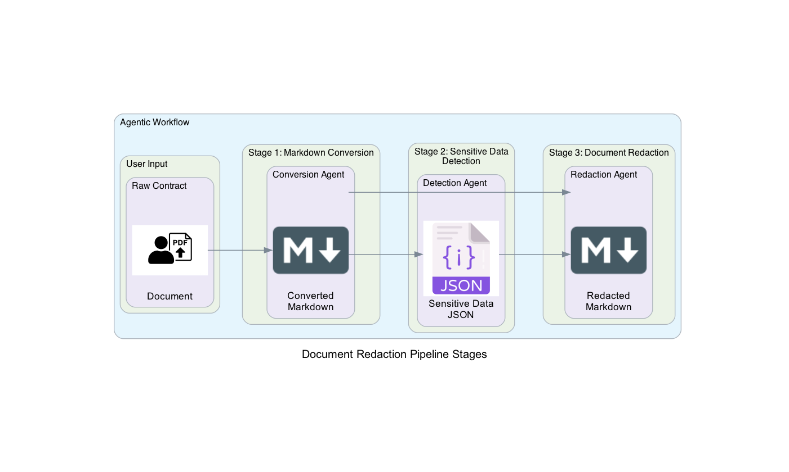

# Document Redaction Automation Service

- **Github repository**: <https://github.com/deadhand777/doc-redaction/>
- **Documentation** <https://deadhand777.github.io/doc-redaction/>

The purpose of this project is to provide a service that automatically detects and redacts confidential information from documents.

---

### 📖 Background

Contract management and document review are often **manual, non-standardized processes**. These workflows require expensive human resources, are error-prone, and lead to significant opportunity costs.

This service addresses these challenges by:

- **Automating manual review tasks** in seconds instead of hours or days
- **Standardizing the output**, ensuring reliability and transparency
- **Reducing human error** and increasing efficiency in compliance workflows

---

### 🚀 Features

- **Content extraction**
  Extracts text, structure, and embedded elements from documents or images using language models with vision capabilities

- **Content transformation**
  Converts unstructured content into LLM-friendly formats

- **Sensitive information detection**
  Identifies and classifies sensitive data such as:
  - Business-sensitive information
  - Personal data (PII)
  - Financial details
  - Legal obligations

- **Automated redaction**
  Transforms documents into **PII-compliant, shareable versions** by redacting confidential content

- **Knowledge base integration**
  Creates reusable, structured knowledge base content

- **Human-in-the-loop**
  Supports optional manual review and approval to ensure compliance

## Getting started

Please visit the [Getting Started Section](https://deadhand777.github.io/doc-redaction/getting_started/) within the project documentation. Step-by-step guidance is provided there.

## How does it work

The service is a **agentic system** composed of a **multi-step workflow**.

The three-stage document processing pipeline converts, analyzes, and redacts sensitive information from PDF contracts using AI agents powered by AWS Bedrock models.

This workflow enables automated, AI-powered document redaction with full traceability and structured output suitable for compliance and audit requirements.

The user inputs a contract in PDF format or as an image.

The workflow produces multiple outputs:

- Converted Document: Clean markdown representation of the original PDF
- Sensitive Data Catalog: Structured JSON with all detected sensitive information
- Redacted Document: Sanitized version safe for broader distribution
- Process Metrics: Detailed logging and usage statistics for each stage

Sample input and output artifacts can be found in the [data directory](https://github.com/deadhand777/doc-redaction/data/) of this repository.

Raw Contract | Converted Document | Sensitive Data Catalog | Redacted Document
------------ | ------------------ | ---------------------- | -----------------
[Raw spielbank_rocketbase_dienstleistungsvertrag](data/contract/spielbank_rocketbase_dienstleistungsvertrag.pdf) | [Converted spielbank_rocketbase_dienstleistungsvertrag](data/markdown/spielbank_rocketbase_dienstleistungsvertrag.md) | [Extracted spielbank_rocketbase_dienstleistungsvertrag](data/confidential/spielbank_rocketbase_dienstleistungsvertrag.json) | [Redacted spielbank_rocketbase_dienstleistungsvertrag](data/redact/spielbank_rocketbase_dienstleistungsvertrag_redacted.md)
[Raw rocketbase_aws_agreement](data/contract/rocketbase_aws_agreement.pdf) | [Converted rocketbase_aws_agreement](data/markdown/rocketbase_aws_agreement.md) | [Extracted rocketbase_aws_agreement](data/confidential/rocketbase_aws_agreement.json) | [Redacted rocketbase_aws_agreement](data/redact/rocketbase_aws_agreement_redacted.md)
[Raw spielbank_rocketbase_vertrag](data/contract/spielbank_rocketbase_vertrag.pdf) | [Converted spielbank_rocketbase_vertrag](data/markdown/spielbank_rocketbase_vertrag.md) | [Extracted spielbank_rocketbase_vertrag](data/confidential/spielbank_rocketbase_vertrag.json) | [Redacted spielbank_rocketbase_vertrag](data/redact/spielbank_rocketbase_vertrag_redacted.md)

Please visit the [Agentic Workflow Section](https://deadhand777.github.io/doc-redaction/agentic_workflow/) for further details.

## Contributing

Please see the [Contributing Guidelines](CONTRIBUTING.md) for more information on how to contribute to this project.
