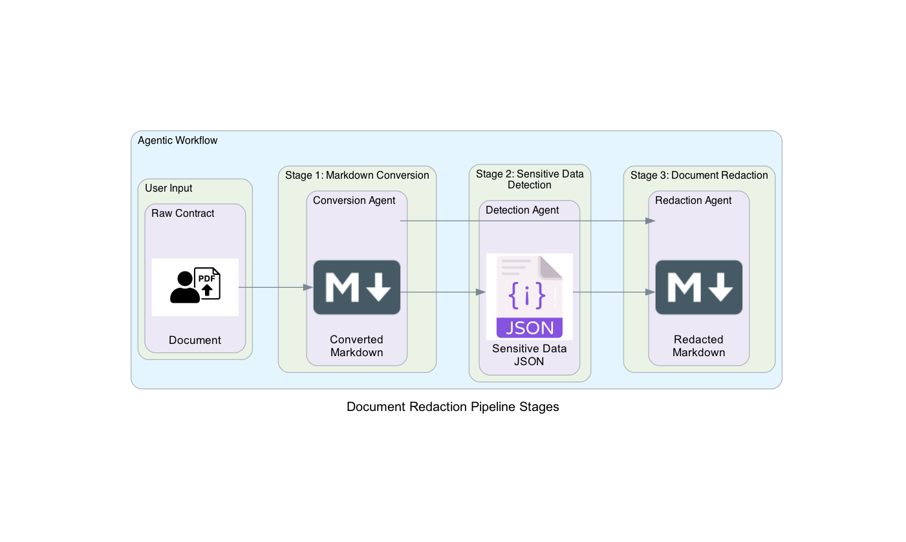

# Agent Workflow

The service is a **agentic system** composed of a **multi-step workflow**.

The three-stage document processing pipeline converts, analyzes, and redacts sensitive information from PDF contracts using AI agents powered by AWS Bedrock models.

### Stage 1: PDF to Markdown Conversion

Multimodal agent uses AI vision capabilities:

- Reads and understands PDF content
- Converts PDF structure and content to clean markdown format
- Preserves document structure, formatting, and content hierarchy

Output: Markdown file representing the original PDF document

### Stage 2: Sensitive Data Detection

Detection agent specialized for sensitive information identification

- Analyzes document content using structured output with SensitiveData model

- Identifies and extracts sensitive information including:
  - Personal information (names, emails, phone numbers)
  - Company details (names, addresses, registration numbers)
  - Document metadata and analysis information
- Applies strict guidelines: only extract information actually present in text

Output: Structured JSON file with detected sensitive information

### Stage 3: Document Redaction

Redaction agent focused on content sanitization

- Systematically redacts all sensitive information identified in Stage 2
- Preserves document structure and non-sensitive content
- Maintains document readability while removing confidential data

Output: Redacted markdown file with sensitive information removed

### Agent Architecture

Specialized Agents: Each stage uses a purpose-built agent with specific:
- System prompts tailored to the task
- Curated tool sets for required operations
- Model configurations optimized for the workload

### Output Artifacts

- Converted Document: Clean markdown representation of the original PDF
- Sensitive Data Catalog: Structured JSON with all detected sensitive information
- Redacted Document: Sanitized version safe for broader distribution
- Process Metrics: Detailed logging and usage statistics for each stage

This workflow enables automated, AI-powered document redaction with full traceability and structured output suitable for compliance and audit requirements.

## Example Input and Output

Sample input and output artifacts can be found in the [data directory](https://github.com/deadhand777/doc-redaction/data/) of this repository.

Raw Contract | Converted Document | Sensitive Data Catalog | Redacted Document
------------ | ------------------ | ---------------------- | -----------------
[Raw rocketbase_aws_agreement](https://github.com/deadhand777/doc-redaction/data/contract/rocketbase_aws_agreement.pdf) | [Converted rocketbase_aws_agreement](https://github.com/deadhand777/doc-redaction/data/markdown/rocketbase_aws_agreement.md) | [Extracted rocketbase_aws_agreement](https://github.com/deadhand777/doc-redaction/data/confidential/rocketbase_aws_agreement.json) | [Redacted rocketbase_aws_agreement](https://github.com/deadhand777/doc-redaction/data/redact/rocketbase_aws_agreement_redacted.md)
[Raw spielbank_rocketbase_vertrag](https://github.com/deadhand777/doc-redaction/data/contract/spielbank_rocketbase_vertrag.pdf) | [Converted spielbank_rocketbase_vertrag](https://github.com/deadhand777/doc-redaction/data/markdown/spielbank_rocketbase_vertrag.md) | [Extracted spielbank_rocketbase_vertrag](https://github.com/deadhand777/doc-redaction/data/confidential/spielbank_rocketbase_vertrag.json) | [Redacted spielbank_rocketbase_vertrag](https://github.com/deadhand777/doc-redaction/data/redact/spielbank_rocketbase_vertrag_redacted.md)
