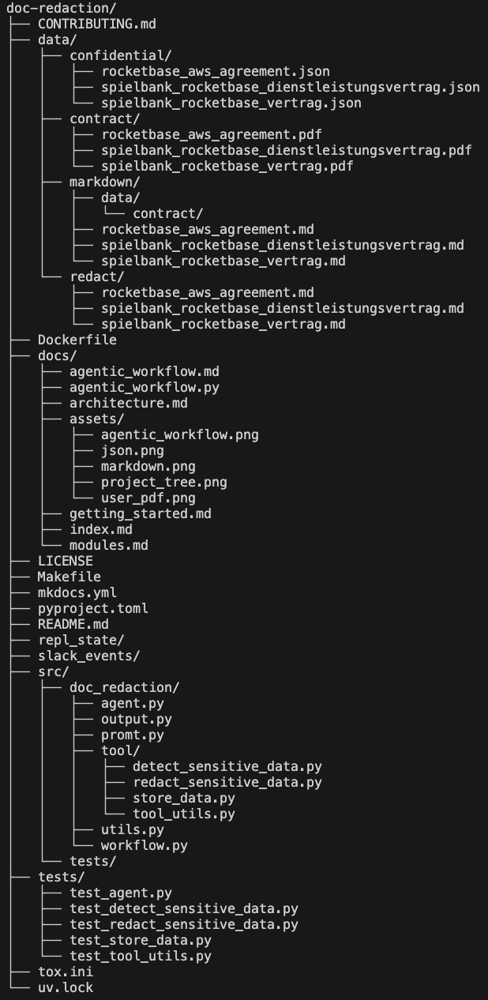

  <h1>
    Document Redaction Automation Service
  </h1>

  <h2>
    The purpose of this project is to provide a service that automatically detects and redacts confidential information from documents.
  </h2>

  

    
    
    
  

  

    
    
    
  

  

    <a href="https://github.com/deadhand777/doc-redaction">Repository</a>
    ◆ <a href="https://deadhand777.github.io/doc-redaction/">Documentation</a>
    ◆ <a href="https://github.com/deadhand777/doc-redaction/discussions">Discussions</a>
  

## Project Structure

The project is organized as follows:

| Path | Type | Description |
|------|------|-------------|
| **Root Directory** | | |
| `pyproject.toml` | Config | Project configuration, dependencies, and build settings |
| `Makefile` | Build | Development automation commands and build scripts |
| `README.md` | Doc | Main project documentation and overview |
| `uv.lock` | Lock | UV package manager lock file for reproducible builds |
| **/data/** | Directory | Document processing data storage |
| `/data/contract/` | Directory | Original PDF contract files for processing |
| `/data/markdown/` | Directory | Converted markdown files from PDF conversion |
| `/data/confidential/` | Directory | JSON files containing detected sensitive data |
| `/data/redact/` | Directory | Final redacted document outputs |
| **/src/doc_redaction/** | Directory | Main application source code |
| `/src/doc_redaction/__init__.py` | Module | Package initialization file |
| `/src/doc_redaction/agent.py` | Module | AI agent creation and configuration |
| `/src/doc_redaction/output.py` | Module | Pydantic models for structured outputs (SensitiveData) |
| `/src/doc_redaction/promt.py` | Module | System prompts for different AI agents |
| `/src/doc_redaction/utils.py` | Module | Utility functions and custom exceptions |
| `/src/doc_redaction/workflow.py` | Module | Main document processing workflow orchestration |
| **/src/doc_redaction/tool/** | Directory | Processing tools and utilities |
| `/src/doc_redaction/tool/__init__.py` | Module | Tool package initialization |
| `/src/doc_redaction/tool/detect_sensitive_data.py` | Tool | Sensitive information detection using regex patterns |
| `/src/doc_redaction/tool/redact_sensitive_data.py` | Tool | Document redaction and content sanitization |
| `/src/doc_redaction/tool/tool_utils.py` | Tool | Utility functions for tool operations |
| `/src/doc_redaction/tool/document_processing.py` | Tool | Large document processing and chunking system |
| **/tests/** | Directory | Test suite for all application components |
| `/tests/test_*.py` | Tests | Comprehensive unit and integration tests |

## Tooling

The templete utilizes the following tools for development, testing, and deployment:

- [uv](https://docs.astral.sh/uv/) for dependency management
- CI/CD with [GitHub Actions](https://github.com/features/actions)
- Pre-commit hooks with [pre-commit](https://pre-commit.com/)
- Code quality with [ruff](https://github.com/charliermarsh/ruff), [ty](https://docs.astral.sh/ty/) and [prettier](https://prettier.io/)
- Documentation with [MkDocs](https://www.mkdocs.org/)
- Compatibility testing for multiple versions of Python with [tox-uv](https://github.com/tox-dev/tox-uv)
- Containerization with [Docker](https://www.docker.com/)

## Getting Started

See [Getting Started](https://deadhand777.github.io/doc-redaction/getting-started/)

## Architecture

See [Architecture](https://deadhand777.github.io/doc-redaction/architecture/)

## Modules and Features

See [Modules](https://deadhand777.github.io/doc-redaction/modules/) documentation.
